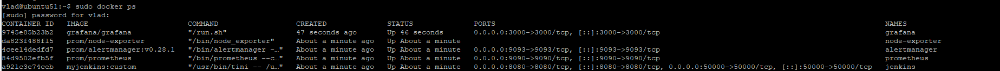
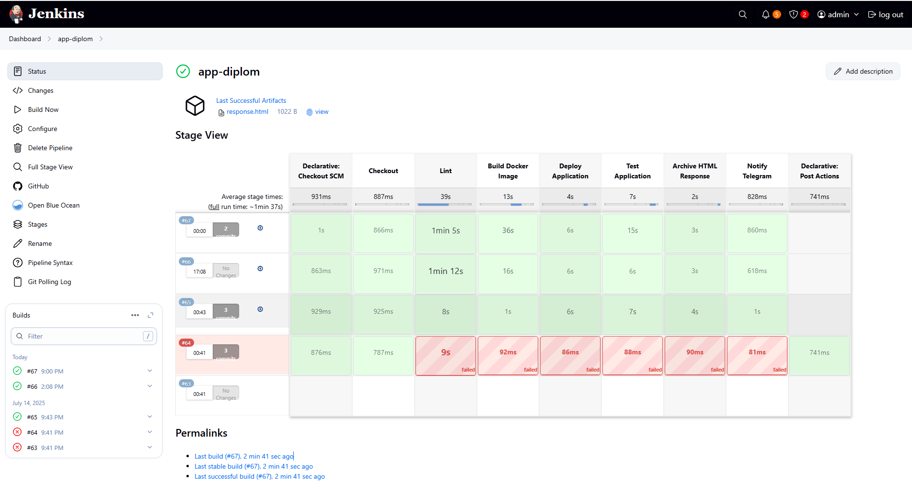
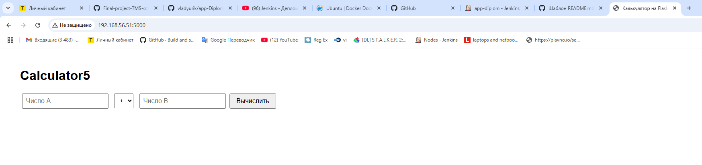
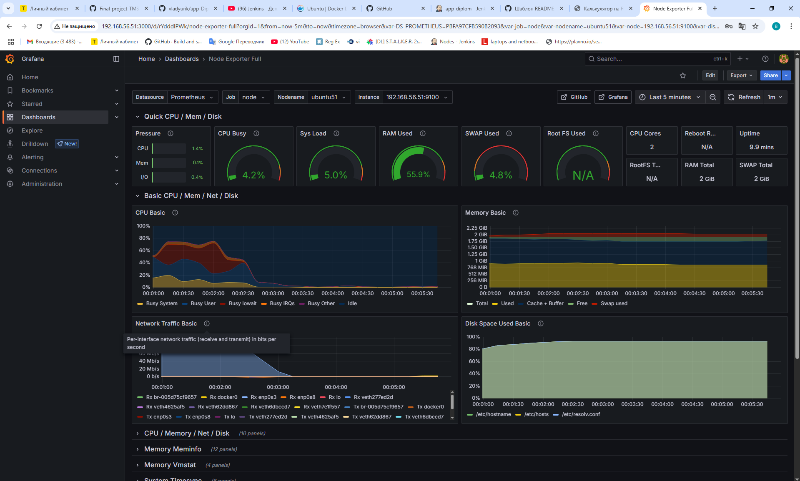
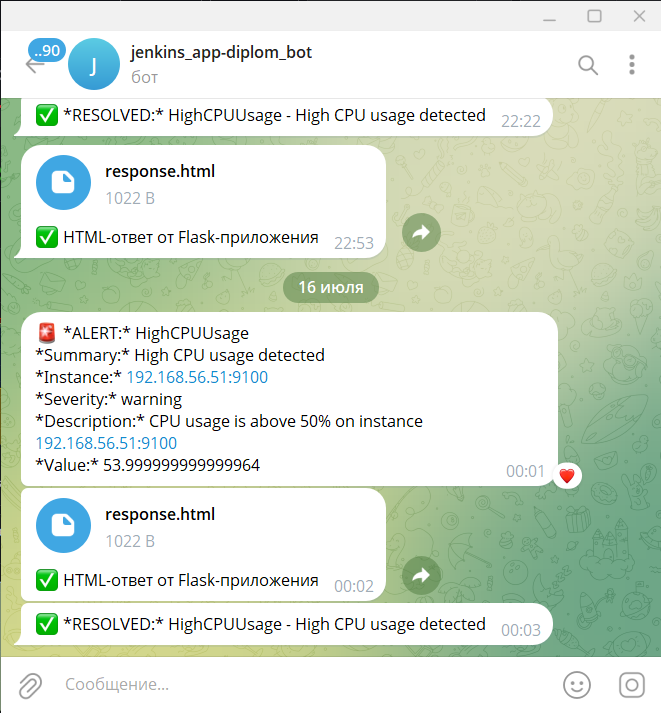

# 🧪 DevOps Дипломный проект — TMS School

Этот проект является результатом обучения в **TMS School** и служит практикой автоматизации инфраструктуры, CI/CD процессов и настройки мониторинга приложения и среды.

---

## 🎯 Цель проекта

- Получить практический опыт в:
  - автоматизации развёртывания инфраструктуры с помощью **Ansible**,
  - настройке **CI/CD пайплайна** на **Jenkins**,
  - развёртывании и мониторинге приложения с использованием **Prometheus**, **Grafana**, **Alertmanager**,
  - работе с контейнерами **Docker**,
  - построении связки между инфраструктурой и приложением.

---

## 📦 Структура проекта

Проект разбит на два основных репозитория:

| Назначение | Репозиторий |
|------------|-------------|
| Ansible-автоматизация и конфигурация Jenkins | [Final-project-TMS-school](https://github.com/vladyurik/Final-project-TMS-school/tree/main/roles) |
| Исходный код приложения и Jenkins pipeline | [app-Diplom](https://github.com/vladyurik/app-Diplom/tree/main) |

---

## ⚙️ Инфраструктура

- **2 Linux-хоста (Ubuntu 22.04)**:
  - **Хост 1**: Ansible, Docker
  - **Хост 2**: Docker
- Связь по SSH между хостами (из первого ко второму)
- Минимальные системные требования: 2 vCPU, 2 ГБ RAM на каждом хосте

---

## 🚀 Развёртывание

1. Клонируйте репозиторий с Ansible-ролями:

   ```bash
   git clone https://github.com/vladyurik/Final-project-TMS-school.git
   ```

2. Настройте инвентаризацию и переменные:

   - Отредактируйте `hosts.ini` с IP-адресами ваших серверов
   - Настройте параметры в `group_vars/all.yml` (например, Telegram token, IP и т.д.)

3. Запустите развёртывание:

   ```bash
   ansible-playbook -i hosts.ini deploy.yml --ask-vault-pass
   ```

**Проверка создания контейнеров на исполняемом хосте:**



---

## 🛠 CI/CD Pipeline (Jenkins)

1. Откройте браузер по адресу `http://<IP>:8080` и авторизуйтесь в Jenkins
2. Запустите Jenkins pipeline:
   - Пайплайн скачивает [исходный код приложения (Flask-калькулятор)](https://github.com/vladyurik/app-Diplom)
   - Проверяет код линтером `flake8`
   - Собирает Docker-образ
   - Выполняет unit-тесты
   - Пушит алерт о результате выполнения в Telegram
3. После успешного запуска, приложение будет доступно по адресу `http://<IP>:5000`

**Успешно завершённый пайплайн:**



**Доступное приложение "Калькулятор":**



---

## 📊 Мониторинг и алертинг

- **Prometheus** собирает метрики с Jenkins и Flask-приложения
- **Grafana** отображает метрики на дашбордах
- **Alertmanager** отправляет алерты в Telegram при сбоях или отклонениях

**Grafana Dashboard:**



**Полученные алерты в Telegram:**



---

## 📌 Полезные команды

```bash
# Проверить статус всех сервисов Docker
docker ps -a

# Перезапустить Jenkins
sudo systemctl restart jenkins

# Посмотреть логи Prometheus
docker logs prometheus

# Проверка SSH-доступа
ssh user@host2
```

---

## 🧯 Troubleshooting

- **Jenkins не запускается:** проверьте конфигурацию Java и лог `/var/log/jenkins/jenkins.log`
- **Pipeline падает на линтинге:** удостоверьтесь, что `flake8` установлен и правильно настроен
- **Alertmanager не отправляет уведомления:** проверьте правильность токена и ID чата в Telegram

---

## 📮 Контакты

Разработчик: **Юревич Владислав**  
📧 Email: [vladik.yurevch@gmail.com](mailto:vladik.yurevch@gmail.com)

---
